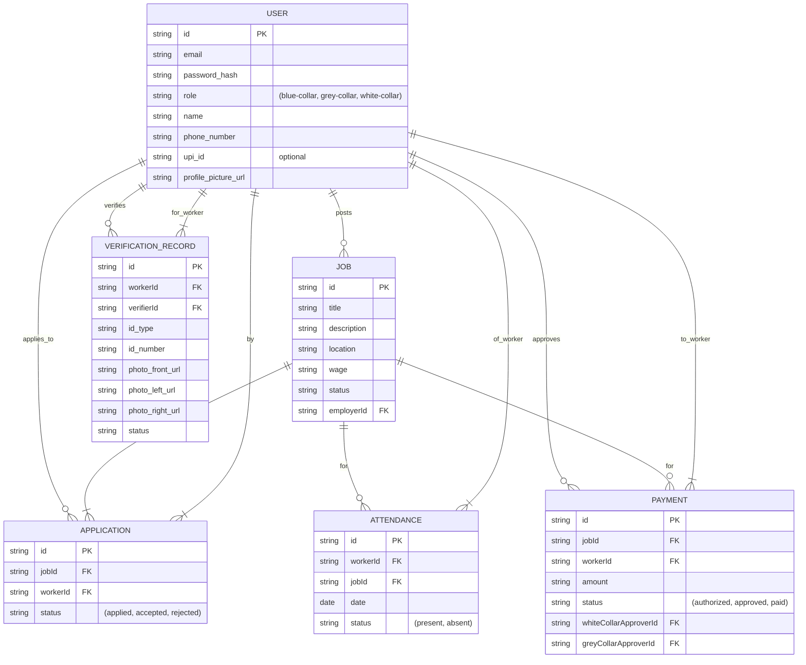

# Database Schema

This document outlines the database schema for the Kaabil Sewak platform, visualized as a Mermaid ERD.

```mermaid
erDiagram
    USER {
        string id PK
        string email
        string password_hash
        string role "(blue-collar, grey-collar, white-collar)"
        string name
        string phone_number
        string upi_id "optional"
        string profile_picture_url
    }

    JOB {
        string id PK
        string title
        string description
        string location
        string wage
        string status
        string employerId FK
    }

    APPLICATION {
        string id PK
        string jobId FK
        string workerId FK
        string status "(applied, accepted, rejected)"
    }

    VERIFICATION_RECORD {
        string id PK
        string workerId FK
        string verifierId FK
        string id_type
        string id_number
        string photo_front_url
        string photo_left_url
        string photo_right_url
        string status
    }

    ATTENDANCE {
        string id PK
        string workerId FK
        string jobId FK
        date date
        string status "(present, absent)"
    }

    PAYMENT {
        string id PK
        string jobId FK
        string workerId FK
        string amount
        string status "(authorized, approved, paid)"
        string whiteCollarApproverId FK
        string greyCollarApproverId FK
    }

    USER ||--o{ JOB : "posts"
    USER ||--o{ APPLICATION : "applies_to"
    USER ||--o{ VERIFICATION_RECORD : "verifies"
    USER ||--o{ PAYMENT : "approves"

    JOB ||--|{ APPLICATION : "has"
    JOB ||--o{ ATTENDANCE : "for"
    JOB ||--o{ PAYMENT : "for"

    APPLICATION }|--|| USER : "by"

    VERIFICATION_RECORD }|--|| USER : "for_worker"

    ATTENDANCE }|--|| USER : "of_worker"

    PAYMENT }|--|| USER : "to_worker"
``` 